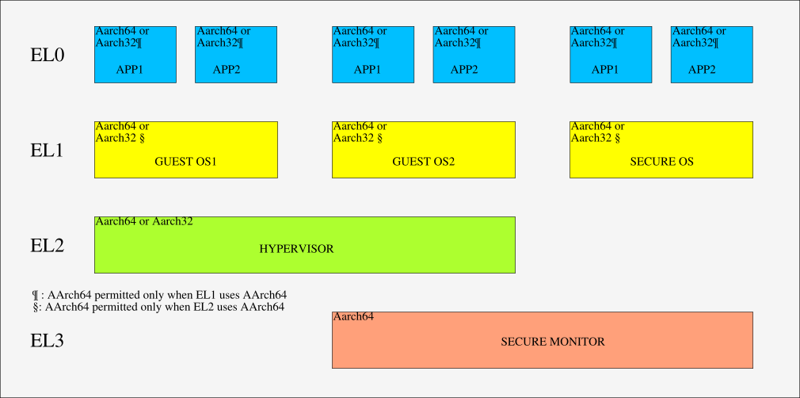

<center><h1>可行性报告</h1></center>
<center><h3>QvQ</h3></center>

## 目录

- [目录](#--)
- [项目介绍](#----)
- [理论依据](#----)
  * [Rust](#rust)
    + [所有权](#---)
    + [特型](#--)
    + [过程宏](#---)
- [技术依据](#----)
  * [Redleaf](#redleaf)
    + [引导](#--)
    + [内核入口点](#-----)
    + [init 进程](#init---)
    + [域](#-)
    + [接口生成](#----)
      - [初始化](#---)
      - [Proxy](#proxy)
    + [RRef](#rref)
    + [Shared heap](#shared-heap)
    + [Drop domain](#drop-domain)
    + [ELFLoader](#elfloader)
    + [架构相关 ( x86 )](#-------x86--)
  * [rCore](#rcore)
    + [启动](#--)
    + [内存管理](#----)
      - [物理内存分配](#------)
      - [内存分页](#----)
        * [rCore 的地址空间映射](#rcore--------)
        * [切换到虚拟地址空间](#---------)
        * [内核重映射](#-----)
      - [堆分配](#---)
        * [MemorySet](#memoryset)
    + [进程管理](#----)
      - [相关系统调用](#------)
        * [fork](#fork)
        * [waitpid](#waitpid)
        * [exec](#exec)
  * [硬件相关](#----)
    + [引导](#---1)
      - [直接引导](#----)
      - [使用其他固件](#------)
    + [ARMv8 Exception Level](#armv8-exception-level)
- [技术路线](#----)
- [参考资料](#----)

## 项目介绍

RedLeaf 提供了一种基于 Rust 语言的，不同内核模块间隔离的模式，该设计的跨域调用性能远超采用 IPC 的传统微内核 ( seL4 )，相比近年的利用硬件加速 x86 平台 IPC 的 虚拟化技术 及 内存保护密钥技术 也有显著的性能提升。

本项目的最终目标，为将该思路应用于一个 ARM 架构嵌入式设备 ( 参照 rCore Tutorial )，构建一内核，以求以较低开销换取故障隔离，透明恢复等优势，从而提高系统稳定性，安全性，保障众多高要求场景下的长期平稳运行。

出于工作量考虑，用户态支持将作为可选项，预期在内核开发完成后，首先将 实现 / 移植 少量 基础内核模块 / 驱动，以便在 `init` 中测试内核的性能和稳定性，验证设计理念。

由于 QEMU 直接提供树莓派的设备支持，同时我们的内核仅出于学习目的，通用性不是优先考虑，如果基于此模拟设备设计一个树莓派专用的内核，有利于减轻工作量，同时也便于我们最终在实机上运行，以测试性能，故开发工作考虑基于此展开。

## 理论依据

### Rust

#### 所有权
Rust 的所有权机制是 Redleaf 中单一所有权的基础，配合 RRef 等智能指针，Rust 得以在甚至域崩溃的条件下安全回收全部内存，而带来开销远远低于 GC

#### 特型
特型帮助我们实现内核和域之间的松耦合和动态绑定，强大的 Trait 能为开发提供极大助力

#### 过程宏
Rust 提供过程宏和强大的语法树解析机制，能帮助我们实现接口代码的自动生成，以保障跨域的操作能得到正确实现，同时减轻人工检查的负担

## 技术依据

### Redleaf

#### 引导

使用 GRUB 配合 Multiboot 头引导内核

``` shell
SECTIONS {
  . = 0x100000; /* Tells GRUB to load the kernel starting at the 1MiB mark */

  .rodata :
  {
    /* ensure that the multiboot header is at the beginning */
    KEEP(*(.multiboot_header))
    *(.rodata .rodata.*)
    . = ALIGN(4K);
  }
  // ...
}
```


#### 内核入口点

- GDT 等架构特有初始化操作
- 中断
    - APIC
    - IDT
- 内存
    - 物理内存分配采用伙伴算法，物理内存范围由 GRUB 探测
    - 初始化页表，完成对内核空间的映射
- 其他核心初始化，开始执行
- 初始化内核域，确保能为其他用户态执行的基本域提供系统调用接口 (函数调用实现)
- 初始化 `rref` 支持
- 初始化进程调度器
- 创建 `init `线程
- 开启中断，此后调度器介入，将从当前唯一非 `idle` 线程 `init` 开始调度

#### init 进程

- 加载并初始化附加在内核镜像尾的基本域，为后续挂载文件系统，加载 `initfs` 中的其他域做准备

- 一切就绪后，加载 `xv6` 所在域，启动非系统服务的用户进程，通过向 `xv6` 分派中断，完成系统调用 (软中断 + 函数调用)，为应用进程提供服务

#### 域

域通过 Rust 的特型在内核和用户模块间维持统一的接口，通过两种方式进行加载到内存

- static: 将 ELF 附加在内核镜像尾，由 Bootloader 加载，提供最基本的服务
- blob: 由内核从文件系统中加载

域会记录在其中执行的线程，加载的 ELF 地址等信息

```rust
pub struct Domain {
    pub id: u64,
    pub name: String,
    pub mapping: Vec<(VAddr, usize, u64, MapAction)>,
    /// Offset where ELF is located.
    pub offset: VAddr,
    /// The entry point of the ELF file.
    pub entry_point: VAddr,
    /// List of threads in the domain
    //threads: Option<Arc<Mutex<Rc<RefCell<Thread>>>>>,
    threads: DomainThreads,
}
```

域的实现难点之一在于生成内核可直接调用的初始化代码，为此，redleaf 首先引入了最基本的系统调用特型 (内核域实现)，晚绑定到每一个域的初始化接口上

内核域之后，第一个被加载的是 `redleaf_init` 域，该域中初始化了模块间的代理层，并逐个调用各个域的初始化代码

``` rust
#[no_mangle]
pub fn trusted_entry(
    s: Box<dyn syscalls::Syscall + Send + Sync>,
    heap: Box<dyn syscalls::Heap + Send + Sync>,
    ints: Box<dyn syscalls::Interrupt + Send + Sync>,
    create_proxy: Arc<dyn interface::domain_create::CreateProxy>,
    create_pci: Arc<dyn interface::domain_create::CreatePCI>,
    create_membdev: Arc<dyn interface::domain_create::CreateMemBDev>,
    create_bdev_shadow: Arc<dyn interface::domain_create::CreateBDevShadow>,
    create_ixgbe: Arc<dyn interface::domain_create::CreateIxgbe>,
    create_virtio_net: Arc<dyn interface::domain_create::CreateVirtioNet>,
    create_virtio_block: Arc<dyn interface::domain_create::CreateVirtioBlock>,
    create_net_shadow: Arc<dyn interface::domain_create::CreateNetShadow>,
    create_nvme_shadow: Arc<dyn interface::domain_create::CreateNvmeShadow>,
    create_nvme: Arc<dyn interface::domain_create::CreateNvme>,
    create_xv6fs: Arc<dyn interface::domain_create::CreateRv6FS>,
    create_xv6net: Arc<dyn interface::domain_create::CreateRv6Net>,
    create_xv6net_shadow: Arc<dyn interface::domain_create::CreateRv6NetShadow>,
    create_xv6usr: Arc<dyn interface::domain_create::CreateRv6Usr>,
    create_xv6: Arc<dyn interface::domain_create::CreateRv6>,
    create_dom_c: Arc<dyn interface::domain_create::CreateDomC>,
    create_dom_d: Arc<dyn interface::domain_create::CreateDomD>,
    create_shadow: Arc<dyn interface::domain_create::CreateShadow>,
    create_benchnvme: Arc<dyn interface::domain_create::CreateBenchnvme>,
    create_tpm: Arc<dyn interface::domain_create::CreateTpm>,
) {
    libsyscalls::syscalls::init(s);
    interface::rref::init(heap, libsyscalls::syscalls::sys_get_current_domain_id());

    let ints_clone = ints.int_clone();
    libsyscalls::syscalls::init_interrupts(ints);

    //let b = Box::new(4);
    //let r = sys_alloc();
    let mut v1: Vec<u64> = Vec::with_capacity(1024);
    for i in 0..2048 {
        v1.push(i);
    }

    println!("{} {} {}", "init", "userland", 1);

    //println!("init userland print works");

    #[cfg(feature = "test_guard_page")]
    {
        println!("start the test guard page test");
        let foo = test_stack_exhaustion();
        println!("test guard page: {}", foo);
    }

    #[cfg(feature = "test_timer_thread")]
    {
        let t = sys_create_thread("init_int[timer]", timer_thread);
        t.set_priority(10);
    }
    // ...
}
```

#### 接口生成

由于每个用户域都有大部分相同的接口代码，用来和内核，或者是其它域交互，redleaf 的胶水代码基本都是由 redIDL 生成的，生成过程 中 redIDL 大量使用了 Rust 过程宏，并通过对语法树进行解析生成标准接口 

##### 初始化

初始化接口首先要考虑如何加载域

对于 static 方式的域，由于 `ld - b binary` 链接时会在 `obj` 文件中留下域位置的符号，redIDL 读取符号，添加创建，加载域，创建线程，传递系统调用接口，执行用户入口点

对于 blob 方式的域，原理也基本相仿

``` rust
let generated_fn = parse_quote! {
    pub(crate) fn #generated_fn_ident(#(#selfless_args),*) #rtn {
        // Entering kernel, disable irq
        crate::interrupt::disable_irq();

        extern "C" {
            fn #domain_start_ident();
            fn #domain_end_ident();
        }

        let binary_range_ = (
            #domain_start_ident as *const u8,
            #domain_end_ident as *const u8,
        );

        type UserInit_ =
        fn(#(#entry_point_args),*) -> #ep_rtn;
        // ...
    }
}
```

##### Proxy

redIDL 在 proxy 中插入了配合栈展开的代码，在经由 proxy 的远程调用 `panic` 后，控制流会跳回到 proxy，从而可以返回异常信息，或开展后续的清理和恢复工作，避免了整个内核的崩溃

``` rust
quote! {
    // Wrapper of the original function.
    // The trampoline should call this after saving the continuation stack.
    #[cfg(feature = "trampoline")]
    #[cfg(feature = "proxy")]
    #[no_mangle]
    extern fn #trampoline_ident(#domain_variable_ident: &alloc::boxed::Box<dyn #trait_ident>，#args) #return_ty {
      (&**#domain_variable_ident).#ident(#args)
    }

    // When the call panics，the continuation stack will jump this function.
    // This function will return a `RpcError::panic` to the caller domain.
    #[cfg(feature = "trampoline")]
    #[cfg(feature = "proxy")]
    #[no_mangle]
    extern fn #trampoline_err_ident(#domain_variable_ident: &alloc::boxed::Box<dyn #trait_ident>，#args) #return_ty  								{
      #[cfg(feature = "proxy-log-error")]
      ::console::println!("proxy: {} aborted"，stringify!(#ident));

      Err(unsafe{crate::rpc::RpcError::panic()})
    }
  // ...
}

```

#### RRef

RRef 是对共享堆上对象的引用，是 RPC 的重要组成，由三部分构成

``` rust
pub struct RRef<T> where T: 'static + RRefable {
    domain_id_pointer: *mut u64,
    pub(crate) borrow_count_pointer: *mut u64,
    pub(crate) value_pointer: *mut T
}
```

在 RRef 被丢弃时，堆上数据也被一并丢弃，或者当 RRef 所在域被丢弃时，域上的数据会相应根据引用计数被丢弃

#### Shared heap

在 Redleaf 中，我们使用域来进行轻量级的隔离。当域之间需要进行数据和信息的共享时，要用到所有域共享的共享堆。用该共享堆进行对象的交换，实质上是对对象单一所有权的交换（保证了非零拷贝复制的优越），这也来自于 Rust 语言自身的特性。

当一个对象被插入共享堆时，除了存储此对象空间大小、此对象种类 id 等信息，我们要将更完整的信息保存，以实现上述功能。

```rust
    let domain_id_pointer = MEM_PROVIDER.alloc(Layout::new::<u64>()) as *mut u64;
    let borrow_count_pointer = MEM_PROVIDER.alloc(Layout::new::<u64>()) as *mut u64;
    let value_pointer = MEM_PROVIDER.alloc(layout);

    let allocation = SharedHeapAllocation {
        value_pointer,
        domain_id_pointer,
        borrow_count_pointer,
        layout,
        type_id,
    };
```

- `domain_id_pointer` 表明了对象的存储域，或是声明域，不会改变。若在域 A 声明了共享对象 a，其他域可以访问 a。但若域 A 崩溃，a 会被释放，其他域对 a 的引用返回错误，而并不会引发灾难（安全隔离）。

- `borrow_count_pointer` 是当前对象 a 的所有权域，随着对象在域之间的移动进行变更。初始时为域 A ，但之后域 B 访问此对象即变更为 B（所有权追踪）。**所有权也要随对象的释放更新。**
- `value_pointer` 真实数据存储位置的指针，用于数据的访问、未来释放时位置的查找。

#### Drop domain 

仅删除共享堆上的某一对象还是比较简单的：找到相应的地址、删除数据、删除存储域和所有权域的指针。

通过 `drop domain` 清空某一域中声明的所有共享对象时，直接在共享堆对象表中所有目标域中的对象进行删除。

```rust
// the list of allocations belonging to the domain
    let mut queue = Vec::<SharedHeapAllocation>::new();

    // remove all allocations from list that belong to the exited domain
    allocations.lock().retain(|_, allocation| {
        if *(allocation.domain_id_pointer) == domain_id {
            queue.push(*allocation);
            false
        } else {
            true
        }
    });
```

共享堆对象分配列表以地址为索引，使用哈希表保存，在此处用域的 ID 作索引进行遍历，查找效率低，可以考虑以此为键构建平衡树，将 $O(N)$（$N$ 为对象总数）的时间复杂度降至 $O(log_2N+M)$（$M$ 为此域中待删除对象的数量）。但同时单个对象分配和释放的开销将会提升，考虑到域的销毁仅在崩溃等少数情况出现，此处采用以地址为索引的哈希表还是有一定的优势的。

之后递归地遍历队列中的每一个对象，删除其数据段、存储域指针、所有权域指针。

```rust
DROPPER.drop(allocation.type_id, allocation.value_pointer);
unsafe {
    MEM_PROVIDER.dealloc(allocation.value_pointer, allocation.layout);
    MEM_PROVIDER.dealloc(
        allocation.domain_id_pointer as *mut u8,
        Layout::new::<u64>(),
    );
    MEM_PROVIDER.dealloc(
        allocation.borrow_count_pointer as *mut u8,
        Layout::new::<u64>(),
    );
}
```


#### ELFLoader

相比一般的内核，Redleaf 的设计模式更加依赖早期 ELF 的加载，以提供基本的系统服务

加载前分配内存，记录可分配的开头、分配的末尾、大小，找到对齐的页，按需求大小分配连续的空间。

```rust
let page_base: VAddr = VAddr::from(base & !0xfff); // Round down to nearest page-size
let size_page = round_up!(size + (base & 0xfff) as usize, BASE_PAGE_SIZE as usize);
assert!(size_page >= size);
assert_eq!(size_page % BASE_PAGE_SIZE, 0);
assert_eq!(page_base % BASE_PAGE_SIZE, 0);
```

然后根据 ELF 文件头设置内存读写权限 

ELF 文件重定位时，将入口地址与偏移量相加，得到地址 addr。再通过 addr -> paddr -> vaddr，得到能写入的内核虚拟地址（平移过的虚拟地址）。

```rust
let addr = self.offset + entry.get_offset();
// Translate `addr` into a kernel vaddr we can write to:
let paddr = {
    let mut _paddr: PAddr = PAddr::from(0 as usize);
    {
        let ref mut vspace = *VSPACE.lock();
        _paddr = vspace.resolve_addr(addr).expect("Can't resolve address");
    }
    _paddr
};
let vaddr: VAddr = paddr_to_kernel_vaddr(paddr);
```

#### 架构相关 ( x86 )

`memory.rs`：声明、定义地址空间的文件，在这里构建 `x86-64` 下的地址空间。将基地址声明为 0x0000，堆大小为  2\*1024\*1024。同时进行了虚拟地址和物理地址的映射（极其原始简单）。

`calling.h`：汇编文件，负责 `x86-64` 函数调用（callee-saved）。首先，将寄存器保存在 x\*8 位置的地址中，并设置 `SIZEOF_PTREGS` 变量检测堆栈的结束。通过 `SAVE_EXTRA_REGS ` （汇编宏定义）保存相应的寄存器，调用结束后再通过 `RESTORE_EXTRA_REGS ` 恢复，同时将部分寄存器用 `xorl` 清零。在最后 define 了 `swapgs` 和 `swapfs`。

`percpu.h`：可能是精简过的 linux 源码。`PER_CPU_VAR` 可访问其他 CPU 该变量的副本。

`processor-flags.h`：定义 `X86_EFLAGS` 寄存器和控制寄存器（`CR0~CR4`）相关位。

`vspace.rs`：空间管理、分配。

- 枚举类型 `MapAction` 决定页面权限和大小（4KiB~1GiB）。

- `VSpace` 是系统创建的全局地址空间（物理地址从 0x0u64 开始）。给出了基址加偏移的物理地址虚拟地址转换关系，并且以 `BASE_PAGE_SIZE` 的大小对齐。

  ```rust
  /// # Example
      /// `map_identity(0x2000, 0x3000)` will map everything between 0x2000 and 0x3000 to
      /// physical address 0x2000 -- 0x3000.
      pub(crate) fn map_identity(&mut self, base: PAddr, end: PAddr, rights: MapAction) {
          self.map_identity_with_offset(PAddr::from(0x0), base, end, rights);
          unsafe {
              x86::tlb::flush_all();
          }
      }
  ```

先从 1GiB 开始逐页分配，再由 2MiB、4KiB 填满，直到分配的空间能够覆盖掉申请需求。

我们申请页时靠 permission bit 的保证此页能否被占用（申请成功后置位）。为了地址空间的安全性，系统在申请到的连续地址空间的一前一后都设置 guard_page，防止被占用。

  ```rust
  pub(crate) fn alloc_stack_guarded(&mut self, num_pages: usize) -> VAddr {
          // Allocate num_pages + 1 for the guard page
          let stack_region = VSpace::allocate_pages(num_pages + 1, ResourceType::Memory);
  
          // unmap the first page to make it a guard page
          self.set_guard_page(paddr_to_kernel_vaddr(stack_region));
  
          paddr_to_kernel_vaddr(stack_region)
      }
  ```

当然，还包含空间清零初始化、计算地址入口、处理映射关系等可供调用的函数。

### rCore
目前内核中三大模块：内存管理、进程管理、文件系统，作为独立的 crate 存在。

rCore 指导书 rCore Tutorial 虽然是针对 RISC-V 撰写，但同样有很高的参考价值。

#### 启动

由 OpenSBI 为内核配置好运行环境并移交控制权，内核入口设置栈寄存器后，即可跳转到 Rust 代码。
同时，OpenSBI 也会完成对于包括物理内存在内的各外设的扫描，将扫描结果以 DTB(Device Tree Blob) 的格式保存在物理内存中。通过 `a1` 寄存器传递给内核。
#### 内存管理

##### 物理内存分配
伙伴算法把所有的空闲页框分为11个块链表，每块链表中分布包含特定的连续页框地址空间，第0个块链表包含大小为2 ^ 0个连续的页框，第1个块链表中，每个链表元素包含2 ^ 1个页框大小的连续地址空间，….，第10个块链表中，每个链表元素包含2 ^ 10个页框大小的连续地址空间。每个链表中元素的个数在系统初始化时决定，在执行过程中，动态变化。

##### 内存分页
页表以页为单位，实现虚拟地址到物理地址的映射。

`alloc_frame()` 把一个三级页表作为根，并为其申请一个物理页帧进行存储，在此基础上插入映射，逐级递增：首先在此三级页表中建立关于二级页表的索引三级页表项，以此类推。

基于类 `PageTableEntry`，rCore 封装了`PageEntry` ，表示单个映射。里面分别保存了一个页表项 `PageTableEntry` 的可变引用，及找到此页表项的虚拟页。

rCore 采用非递归线段树来维护物理页帧，节点上的值表示这个节点对应的区间内是否还有空闲物理页。

###### rCore 的地址空间映射


###### 切换到虚拟地址空间
1. 分配页表所在内存空间并初始化页表。
2. 设置好页基址寄存器（指向页表起始地址）。
3. 刷新 TLB。

###### 内核重映射
在 rCore 中，内核通过访问虚拟内存来间接访问物理内存：

``` rust
/ src/consts.rs
pub const PHYSICAL_MEMORY_OFFSET: usize = 0xffffffff40000000;
// src/memory/mod.rs
// 将物理地址转化为对应的虚拟地址
pub fn access_pa_via_va(pa: usize) -> usize {
    pa + PHYSICAL_MEMORY_OFFSET
}
```

##### 堆分配
为了能直接使用 Rust 核心库中的的堆分配操作(`Box<T>` 等)，我们需要为自己的内存分配器实现`alloc::alloc::GlobalAlloc` 特型，并使用属性 `#[global_allocator]` 标记。

###### MemorySet

通过更高一层的抽象屏蔽了底层具体映射方法的实现，同时为线程的内存段式管理提供更易用的接口


#### 进程管理

rCore 采用的一种非常简单的进程模型，有三个运行状态：就绪态、运行态和等待态；有基于独立页表的地址空间；可被操作系统调度来分时占用 CPU 执行；可以动态创建和退出；可通过系统调用获得操作系统的服务。

##### 相关系统调用
进程模型需要操作系统支持一些重要的系统调用：创建进程、执行新程序、等待进程结束等，来达到应用程序执行的动态灵活性。

###### fork

`init` 是在内核中以硬编码方式创建的唯一一个进程。其他所有的进程都是通过一个名为 `fork` 的系统调用来创建的。

```rust
pub fn sys_fork() -> isize;
```

一个父进程主动调用 `fork` 可以衍生出来多个新进程，称为原进程的子进程。它们的用户态的代码段、堆栈段及其他数据段的内容完全相同，但是被放在了两个独立的地址空间中。 

唯有用来保存 `fork` 系统调用返回值的 `a0` 寄存器的值是不同的。这区分了两个进程：父进程的返回值为它新创建子进程的 PID ，而新创建子进程的返回值为 0。

每个进程可能有多个子进程，但最多只能有一个父进程，于是所有进程可以被组织成一颗树，其根节点正是代表用户初始程序——initproc，也即第一个用户态的初始进程。

###### waitpid

当一个进程通过 `exit` 系统调用退出之后，它所占用的资源并不能够立即全部回收。可以当进程退出的时候内核立即回收一部分资源并将该进程标记为僵尸进程。之后，由该进程的父进程通过一个名为 `waitpid` 的系统调用来收集该进程的返回状态并回收掉它所占据的全部资源，这样这个进程才被彻底销毁。系统调用 `waitpid` 的原型如下：

```rust
pub fn sys_waitpid(pid: isize, exit_code: *mut i32) -> isize;
```

一般情况下一个进程要负责通过 `waitpid` 系统调用来等待它 `fork` 出来的子进程结束并回收掉它们占据的资源，这也是父子进程间的一种同步手段。但这并不是必须的。如果一个进程先于它的子进程结束，在它退出的时候，它的所有子进程将成为进程树的根节点——用户初始进程的子进程。

###### exec

如果仅有 `fork` 的话，那么所有的进程都只能和用户初始进程一样执行同样的代码段，故需要引入 `exec` 系统调用来执行不同的可执行文件：

```rust
pub fn sys_exec(path: &str) -> isize;
```

### 硬件相关

#### 引导

##### 直接引导

以下是经典的树莓派启动流程，使用官方提供的固件进行引导，内核被 GPU 加载到内存，直到内核被加载完成 CPU 才从内核入口点开始执行.


##### 使用其他固件

除了用上述制造商提供的固件直接加载内核，我们也可以先加载其他 Bootloader，再由该 Bootloader 进行引导.

由于树莓派被广泛接受，很多常见的 Bootloader 都有对树莓派的支持实现.

- EDK II : 更完整的 UEFI 实现
- U-Boot : ARM 上更加常用

#### ARMv8 Exception Level

由于没有虚拟化和安全相关目标，本项目的实现中只会使用到 EL0，EL1 两个特权等级



## 技术路线

- 使用树莓派官方固件直接引导内核
- 单核心支持，Round-robin 简单调度
- 简单内存分页支持
- 除内核域外均采用附加方式加载，遵循 Redleaf 域的设计模式，由于 Rust 出于性能等考虑还不支持 Trait 的向上类型转换，Readleaf 的实现不尽完善，本项目将尝试优化重构
- 接口生成部分根据后期开发走向决定沿用 redIDL 或参考自行构建，尝试优化接口创建过程中代码分散，多处需重复修改的问题，进一步解耦，降低代码维护复杂度，提升安全性
- RRef 基本循序 Redleaf 的设计模式，包括背后共享堆的设计，但本项目希望能提供可读性更优的设计
- 域将从串口等简单外设驱动开始，尝试设计，并为其添加异常恢复等功能
- 内核的组织结构可以参考 Sophon<sup>[8]</sup>, 其充分利用了 Rust 语言的特性进行内核的抽象设计

## 参考资料

[1] https://github.com/OSH-2021/x-DisGraFS/blob/main/docs/feasibility.md

[2] https://github.com/OSH-2019/x-rust-freertos/blob/master/docs/feasibility.md

[3] https://os.phil-opp.com/freestanding-rust-binary/

[4] https://www.bookstack.cn/read/rCore_tutorial_doc

[5] https://github.com/rcore-os/rCore

[6] https://www.usenix.org/system/files/osdi20-narayanan_vikram.pdf

[7] https://sel4.systems/About/seL4-whitepaper.pdf

[8] https://github.com/wenyuzhao/Sophon