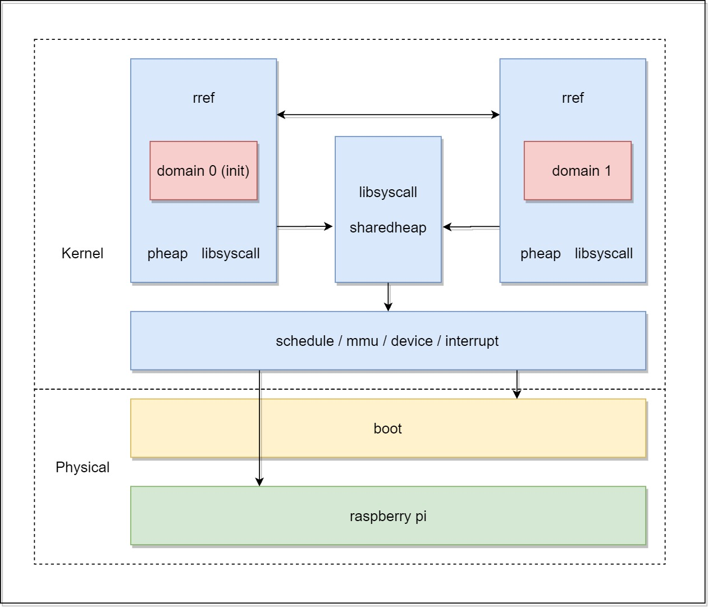

<h1>结题报告</h1>

<h3>QvQ</h3>

## 目录

- [目录](#--)
- [摘要](#--)
- [项目概述](#----)
  * [目标](#--)
- [项目背景](#----)
- [理论依据](#----)
  * [RasPi](#raspi)
  * [ARM](#arm)
  * [Rust](#rust)
- [技术路线](#----)
  * [ARMv8（AARCH64)](#armv8-aarch64-)
    + [MMU](#mmu)
    + [特权等级](#----)
    + [Exception](#exception)
  * [树莓派](#---)
    + [启动](#--)
    + [外设](#--)
      - [Auxiliaries: mini UART & SPI1, SPI2](#auxiliaries--mini-uart---spi1--spi2)
      - [Core Timer](#core-timer)
  * [内核结构](#----)
    + [boot](#boot)
    + [kernel](#kernel)
      - [内存管理](#----)
      - [线程调度](#----)
      - [输入/输出](#-----)
    + [模块化设计](#-----)
      - [Domain](#domain)
      - [Heap](#heap)
      - [模块](#--)
- [项目意义](#----)
- [效果展示](#----)
- [总结分析](#----)
  * [成果](#--)
  * [收获](#--)
  * [经验和教训](#-----)
- [参考文献](#----)

## 摘要
本组最初的目标是在树莓派上仿照Redleaf的设计，通过对堆的分割和所有权管理来精细划分内核模块，同时实现模块的包装机制，以利用 Rust 编译器检查不安全行为。
这种实现方式提高了内核的安全和稳定性，并且易于扩展。与微内核，Unikernel 各有共通之处。很适合用 Rust 实现。
我们错误估计了 ARMv8 的复杂程度和树莓派的文档稀缺程度，加之人手不足，我们没能得到一个扩展性特别良好的内核，但我们实现了他的核心功能: 可以进行虚实页的映射，堆栈分配，内核线程的RR调度，以及部分 MMIO 外设，没有实现用户态是因为参考了 Redleaf 的设计。最终，我们也在树莓派上成功跑通了我们的内核。但上层模块结构只得到初步实现。

## 项目概述
RedLeaf 提供了一种基于 Rust 语言的，不同内核模块间隔离的模式，该设计的跨域调用性能远超采用 IPC 的传统微内核 ( seL4 )，相比近年的利用硬件加速 x86 平台 IPC 的 虚拟化技术 及 内存保护密钥技术 也有显著的性能提升。

本项目的最终目标，为将该思路应用于一个 ARM 架构嵌入式设备 ( 参照 rCore Tutorial )，构建一内核，以求以较低开销换取故障隔离，透明恢复等优势，从而提高系统稳定性，安全性，保障众多高要求场景下的长期平稳运行。

由于 QEMU 直接提供树莓派的设备支持，同时我们的内核仅出于学习目的，通用性不是优先考虑，如果基于此模拟设备设计一个树莓派专用的内核，有利于减轻工作量，同时也便于我们最终在实机上运行，以测试性能，故开发工作考虑基于此展开。

### 目标
- 在树莓派上运行内核, 实现基本的微内核功能
- 内核使用 Redleaf Domain 进行模块化
- 使用 RRef 和内核共享堆实现内核模块间的高效通信

## 项目背景
参见本项目 [调研报告](https://github.com/OSH-2022/x-QvQ/blob/main/docs/research/research.md)，这里不再赘述。

## 理论依据

### RasPi
- RasPi 可以作为了解嵌入式设备的初始落脚点

### ARM
- Arm 处理器体积小、低功耗、低成本、能使我们的设计发挥更大的效用
现有的小型嵌入式系统内核常常不支持模块隔离，其所有的任务运行在同一内存空间，这种做法有助于节省本就有限的系统资源，但缺点是每个被操作系统调度的任务均有可能出错，而由于无法将单个任务崩溃造成的影响控制在此任务之内，整个系统的安全性和稳定性都会随之降低。

### Rust
鉴于大量现有的在内核模块隔离上的工作，我们可以看到采用 Rust 做语言隔离的潜力和优势。

- 相比硬件，Rust 的实现
    - 更通用，可以跨平台实现
    - 更易用，没有复杂的指令集等级的操作，开发成本低
- 相比有运行时开销的语言，如 Go，Rust 的实现
    - 开销更低，几乎无运行时，性能更好
- 相比无运行时开销的传统语言，如 C，Rust 的实现
    - 攻击面更小，安全性更好，绝大多数所有权检查工作由编译器完成，开发者只需关注 unsafe 代码
    - 域内仅使用 safe 代码, 编译器将约束域的未定义行为
    - 开发效率更高，模块化更优秀
- 语言特性
    - 在所有权机制上可以较方便的实现单一所有权
    - 特型便于高效实现内核和服务的解耦
    - 强大的宏和语法树解析功能便于接口实现

我们希望立足 Rust 语言和 RedLeaf 的设计框架，在 ARM 架构上从零开始实现一内核，以求在嵌入式平台上获得性能和安全的共存。

## 技术路线
### ARMv8（AARCH64)
#### MMU
ARMv8 的 MMU 支持多种粒度的分页，每种分页都可以选择不同长度的虚存地址，对应不同的页表级数，并且多级页表可以选择进行段映射，即不必查找到最后一级页表，而是通过中间某一级直接映射对应的大块内存。

为了实现简单，我们把分页粒度定为 4K，树莓派 3B+ 只有 1 GB 内存，无需使用全部的 48 位地址共 4 级页表，我们最终选择了 2 级页表的实现，这是为了使页表在内核不是恒同映射的条件下能较为容易地实现 PageTable Walk（因为页表较小，我们可以直接采取顺序存储的方式，然后按基地址进行索引），后文会详细介绍不采用恒同映射的具体原因。

#### 特权等级
ARMv8 共有 EL3~EL0 4个特权等级，切换特权等级只能通过触发异常和 `eret` 指令实现，树莓派没有实现 EL3，CPU 从 EL2 开始执行，而 EL1 是为内核设计，EL0 则是特权等级最低的用户级。

ARMv8 虚存的高地址部分（即地址高位为1），通过 TTBR1 指向的页表进行映射，而地址部分通过 TTBR0 进行映射，这样有助于减少复制内核页表的开销，因此，我们在设计中决定遵循 ARM 的设计进行开发。这就要求内核不能进行恒同映射，带来了很多链接上的麻烦，详见后文 boot 部分。

#### Exception
在不区分特权等级的前提下，ARMv8 的 Exception 分为四类
- Synchronous Excepotion
    指令导致的异常
- System Error
    异步外部异常，如 Cache 写回时发生的缺页
- IRQ
    中断，如定时器和一般外设
- FIQ
    快速中断，有更高的优先级

发生异常时，`ELR` 会保存 PC, `SPSR` 会保存程序状态，然后根据异常类型和特权等级跳转到向量表的指定位置，向量表实现时要注意按指令集的要求对齐到指定大小。

我们的实现中主要用到了 IRQ 部分。

### 树莓派
#### 启动
树莓派复位后从 GPU 开始执行，`kernel8.img`被加载到`0x80000`处并由此开始执行。刚刚启动时，cache 和 浮点单元都没有被启用，需要对相关寄存器进行配置。

#### 外设
##### Auxiliaries: mini UART & SPI1, SPI2
这三个外设被组合到了一起，映射到一段内存中，并共享一个中断。我们使用到了 mini UART 作为我们内核的输入输出设备。注意，树莓派 3B+ 的 Auxiliary 寄存器没有映射到 BCM2835 手册中注明的 ARM Physical Address IO Peripherals 区域内（`0x20000000`），而是在`0x3f215000`，这在开发中给我们带来了一些困惑。

此外，mini UART 的频率与核心频率绑定，如果想要得到一个稳定的波特率，就必须固定核心频率。

##### Core Timer
ARMv8 每个核心都有相应的 core timer，可以通过相应寄存器来进行控制，如 `CNTP_CTL`，但是，在树莓派上，想要控制 core timer 的分频系数和中断，还必须要额外操作 MMIO 寄存器，他们的定义在另一本介绍 BCM2836 的 Quad-A7 core 的手册中可以找到，其基地址为 `0x4000_0000`。

### 内核结构
我们的内核由三个部分组成，boot，kernel，和在此之上未能完整实现的模块架构。

#### boot
boot 是一段运行在 EL2 实地址的代码，它的基本流程为
- 初始化 bss 段和栈指针
- 构建 2 级页表结构，完成内核的高地址映射
- 为 EL1 启用 MMU 和 Cache
- 启用浮点单元
- 根据链接得到的地址确定内核入口，据此配置 EL2 的 `ELR` 和 `SPSR`
- 准备内核启动参数，如页表地址，内存布局信息等
- `eret` 跳转到内核执行

之所以引入 boot 模块，是因为内核的加载地址和执行地址不同，编写位置无关代码又会带来额外的复杂度，因此，我们选择拆分出 boot 在实地址运行，我们通过 linker script 来正确划分代码的实地址部分和虚地址部分，并辅助安排内核的内存布局。

#### kernel

##### 内存管理
我们的内核主要完成3个内存管理的功能
- 物理页分配
    由于我们的内核目前对内存的需求远低于 1 GB，因此，我们采用了只分配不回收的策略，尽可能简化设计。
- 虚拟页映射管理
    通过上文提到的连续存储页表的做法，我们可以仅依靠 boot 传入的页表虚地址在虚拟地址空间完成 PageTable Walk，并依照 ARMv8 手册，完成对普通内存和设备内存的映射。
- 内核堆
    使用采用隐式空闲链表的 palloc 库，实现 `#[global_allocator]`，从而可以使用 Rust 提供的 Box 等堆分配类型。
##### 线程调度
我们实现了内核线程的抢占式的时间片轮转调度

每个线程有 4K 栈区，在被 core timer 中断抢占后，会在栈顶保存上下文，并在线程控制块记录上下文信息，随后被放入队尾，由调度器选择队头线程继续执行，直到线程主动退出。

##### 输入/输出
内核的输入/输出由 mini UART 完成，均采用轮询设计，为了确保内核能正确输出 panic 信息，我们的 mini UART 在 boot 中即完成内存映射，并作为启动参数之一传递给内核。而其他外设则由内核进行处理。

#### 模块化设计
目前代码实现了一部分，这里介绍完整的实现思路。
##### Domain
通过在内核内部维护链表记录所有 domain，线程控制块添加相应信息，共享堆同理，将在下文介绍。
##### Heap
- 私有堆
私有堆采用普遍的实现方式，实现 libmalloc，向内核申请页，并为用户程序分配，回收堆内存。
- 共享堆
共享堆内的数据可以直接存储在内核堆中，但要根据所在的 domain 做好索引，以便查找，修改，或者转移到其他 domain，共享堆的数据分配通过 libsyscall 进行。

##### 模块
每个模块的入口代码（entry）必须接受 Syscall 特型对象，用于初始化 libsyscall，随后入口再真正调用模块的 main，entry 应由编译工具自动根据 main 生成。
- libsyscall
用来把 Syscall 特型对象中的系统调用接口暴露给模块使用。
- libmalloc
使用 libsyscall 提供的页分配接口，向模块提供私有堆。

同样，模块间的调用接口也会经过自动包装，来维护远程引用，domain的切换等不变量。

## 项目意义
该项目有潜力充分发挥语言隔离的跨平台优势，将高性能，细粒度的内核模块隔离推广到 ARM 架构。

## 效果展示
我们最终在树莓派上成功运行了我们的内核。

## 总结分析
### 成果
- 在 ARMv8 上实现了一个可以进行基本的内存管理，线程调度，外设驱动的内核
- 内核可以在 Raspberry Pi 3B+ 上正常运行
- 对模块化设计做出了部分探索

### 收获
- 学会了 Rust 语言
- 理解了内核的实现方法，而不只是止步于书上的算法描述
- 对ARM、x86、RISC-V等架构有了一定的认识

### 经验和教训
- 要做好时间规划
- 开展工作之前要做好理论知识储备和充分的调研
- 尽量不要同时引入多个风险项，如不熟悉的架构, 不熟悉的语言等
- 设计和组织代码时要有参考，不要凭空发明，否则就要做好大量造轮子的准备

## 参考文献
[QvQ 调研报告](https://github.com/OSH-2022/x-QvQ/blob/main/docs/research/research.md)
[QvQ 可行性报告](https://github.com/OSH-2022/x-QvQ/blob/main/docs/feasibility/feasibility.md)
[i_am_feeling_lucky](https://github.com/OSH-2019/x-i-m-feeling-lucky/blob/master/docs/final_report.md#%E9%A1%B9%E7%9B%AE%E6%9E%B6%E6%9E%84)
[DisGraFS](https://github.com/OSH-2021/x-DisGraFS/blob/main/docs/final_report/conclusion.md)