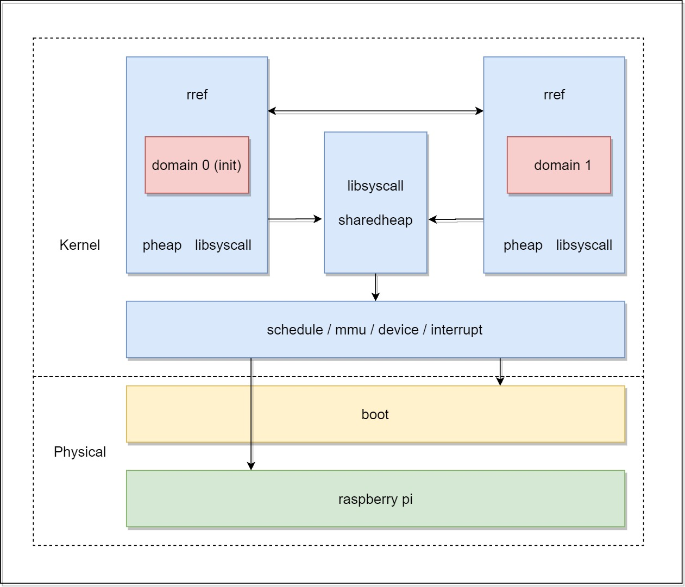

# A Simple Kernel for Raspberry Pi 3B+
QvQ

# 项目概述
## 目标
- 在树莓派上运行内核, 实现基本的微内核功能
- 内核使用 Redleaf Domain 进行模块化
- 使用 RRef 和内核共享堆实现内核模块间的高效通信

# 项目概述
目前目标 1 实现完成, 目标 2, 3 尚有欠缺

# 意义
- 可以把微内核的 libOS 安全地做进内核
- 也可以通过静态链接直接编译成 unikernel

# 设计方案

# 设计方案
## boot
- 运行在物理地址
- 页表构建
- 其他准备工作 (大量问题)

# 设计方案
## mmu
- 采用 2 级页表， 4K 页
- 内核映射到高地址, 为了配合 ARMv8 对地址空间的划分 (大量问题)
- 物理页帧只分配不释放
- 虚拟页帧映射

# 设计方案
## schedule
- 抢占式 RR 调度
- core timer 中断(文档稀缺)

# 设计方案
## device
- miniuart, 与核心频率绑定, 乱码处理

# 总结
- 造轮子的痛并快乐
- 贸然选择不熟悉的架构, 不熟悉的语言
- 要有参考, 不要凭空发明

# 展示

# Q&A

# Thanks