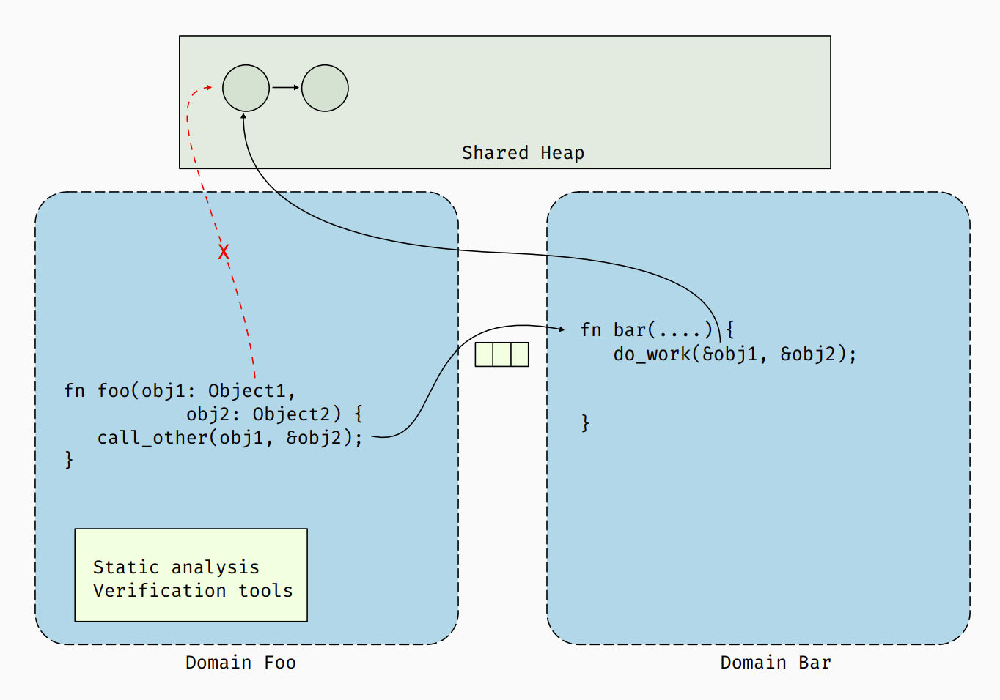
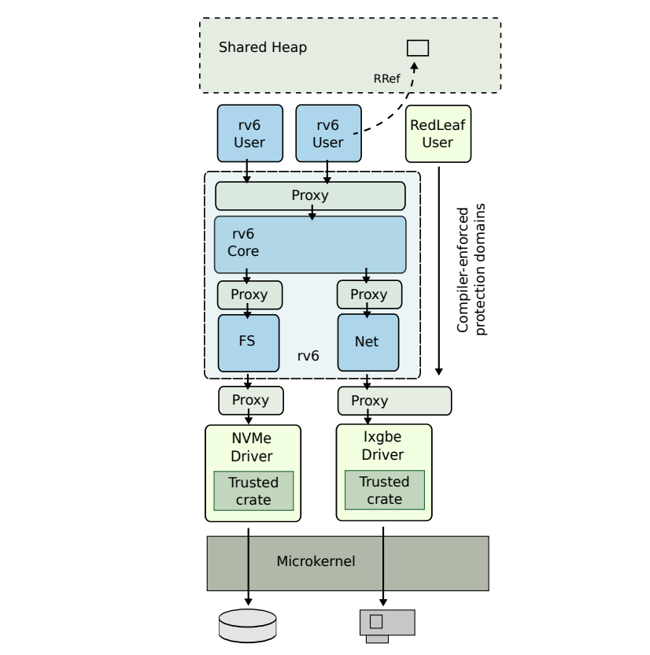

# 语言隔离与内核的模块化设计
QvQ

# 为什么需要隔离良好的模块化设计
- 可靠性
    - 故障隔离
    - 透明恢复
- 定制性
    - 适用性
    - 高性能

# 常见设计模式

- **Linux**
    - 要求开发者负责检查代码, 开发难度大, 安全, 稳定问题难以解决
    - 模块化不充分, 即使是加载的模块也可能使整个内核崩溃

- **SeL4**
    - 完全模块化, 通过系统调用完成系统服务模块间的通信
    - IPC 性能瓶颈

- **Unikernel**
    - 把微内核运行时的模块化开销转移到编译期解决
    - 运行时的模块载入几乎不可能, 只适合作为专用 OS

# 相关工作

- 硬件
    - PKU : 线程级的内存隔离
    - VT-x : 虚拟化加速 IPC
- 语言
    - 深拷贝
    - Capbility
    - 单一所有权 (Singularity / Redleaf)

# Rust 语言隔离的优势
- 高性能
    - 几乎无运行时
- 可靠
    - 域内仅使用 safe 代码, 编译器将约束域的未定义行为
    - 灵活的 unsafe , 仅在内核少量使用
- 语言特性
    - 在所有权机制上可以较方便的实现单一所有权
    - 特型便于高效实现内核和服务的解耦
    - 强大的过程宏和语法树解析功能便于接口实现

# Redleaf 的设计模式

- Microkernel
- Domain
- Shared Heap
- RRef
- ...

# Redleaf 的设计模式
## 域
- 隔离的基本单位
- 以域为单位分割堆和线程
- "嵌入内核里的用户态代码"

# Redleaf 的设计模式
## 堆
- 每个域有独立的私有堆
- 内核提供共享堆, 但在编译期严格检查共享的数据类型, 防止打破域间的隔离
- 跨域传递数据通过传递 RRef 零拷贝实现
- RRef 对共享堆对象进行引用计数和所有权维护

# Redleaf 的设计模式
## RPC 与代理层
- 域直接从内核取得 syscall ints heap 等对象
- 跨域调用的接口严格受约束
- 通过过程宏和 Rust 的代码解析, 自动生成模块入口和跨域接口代码, 以维护前述不变量, 处理异常

# Redleaf 的设计模式
## 接口描述语言
- 使用自定义的扩展语法, 在编译时自动生成符合上述要求的接口

# 我们的目标
- 在树莓派上优化实现一个遵循类似设计模式的内核, 嵌入式更能发挥此设计的优势
- Rust 特型不允许向上类型转换, 尝试其他 workaround, 寻找更优实现
- 优化内核组织结构和接口生成流程, 简化模块的添加
- 模块化适配部分驱动, 进行性能测试

# Thanks