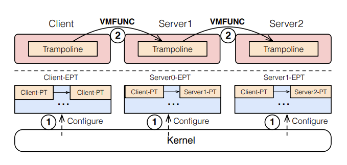
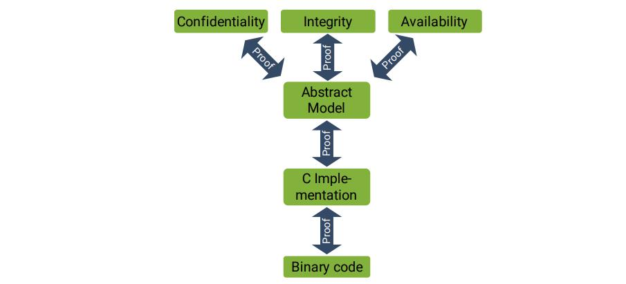
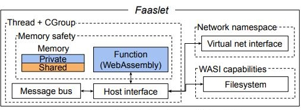

<h1>调研报告</h1>

QvQ

## 目录

- [目录](#--)
- [小组成员](#----)
- [项目概述](#----)
- [项目背景](#----)
  * [兼顾性能与隔离性的内核优化趋势](#---------------)
    + [改进方案](#----)
    + [提高性能](#----)
      - [UnderBridge[4]](#underbridge-sup--4---sup-)
      - [SkyBridge[5]](#skybridge-sup--5---sup-)
    + [加强隔离性](#-----)
      - [Biscuit[6]](#biscuit-sup--6---sup-)
      - [Lightweight Execution Domains[7]](#lightweight-execution-domains-sup--7---sup-)
      - [Lightweight Virtualized Domains[8]](#lightweight-virtualized-domains-sup--8---sup-)
      - [RedLeaf](#redleaf)
  * [嵌入式系统的安全需求](#----------)
  * [嵌入式系统的产业化需求](#-----------)
- [立项依据](#----)
- [相关工作](#----)
  * [Windows on Arm](#windows-on-arm)
  * [嵌入式 OS](#----os)
    + [TencentOS tiny](#tencentos-tiny)
      - [优势](#--)
    + [Huawei LiteOS](#huawei-liteos)
    + [Contiki](#contiki)
    + [RIOT](#riot)
    + [FreeRTOS](#freertos)
    + [ThreadX](#threadx)
    + [QNX](#qnx)
    + [VxWorks](#vxworks)
  * [rCore](#rcore)
  * [FlexOS[9]](#flexos-sup--9---sup-)
  * [seL4](#sel4)
    + [正确性](#---)
    + [Capability](#capability)
    + [实时性](#---)
  * [Faasm轻量级隔离实现高效的有状态无服务器计算[10]](#faasm--------------------sup--10---sup-)
  * [用轻量级协同内核实现性能隔离[11]](#---------------sup--11---sup-)
  * [安全分支预测器的轻量级隔离机制[12]](#----------------sup--12---sup-)
  * [其他](#--)
    + [虚拟机](#---)
    + [容器](#--)
    + [Unikernel](#unikernel)
    + [进程隔离](#----)
- [前瞻性分析](#-----)
- [参考文献](#----)

## 小组成员

- 楚颖 PB20111610
- 耿双越 PB20111639
- 郝英屹 PB20050920
- 隋国冲 PB20111643
- 万方 PB20111645

## 项目概述

RedLeaf[1] 提供了一种基于 Rust 语言的，不同内核模块间隔离的模式，该设计的跨域调用性能远超采用 IPC 的传统微内核 ( seL4[2] )，相比近年的利用硬件加速 x86 平台 IPC 的 虚拟化技术 及 内存保护密钥技术 也有显著的性能提升。

本项目的最终目标，为将该思路应用于一个 ARM 架构嵌入式设备 ( 参照 rCore Tutorial[3] )，构建一个保护模式的实时操作系统 ( 参照 seL4  实时支持 )，以求以较低开销换取故障隔离，透明恢复等优势，从而提高系统稳定性，安全性，保障众多高要求场景下的长期平稳运行。

出于工作量考虑，用户态支持将作为可选项，预期在内核开发完成后，首先将 实现 / 移植 少量 基础内核模块 / 驱动，以便在 `init` 中测试内核的性能和稳定性，验证设计理念。同时，测试平台将以 QEMU 为主。

如果时间有富余，我们也乐于尝试在的树莓派上运行 Hello World。

## 项目背景

### 兼顾性能与隔离性的内核优化趋势

目前，内核模块级的隔离针对的主要有两个大方向。

- 宏内核：所有模块均在同一地址空间。
- 微内核：内核模块运行在用户态。

其中前者本身有性能优势，需要在隔离性上加强;

而后者隔离性较好，但频繁的 IPC 制约了性能，需要在性能上做出改进。

可以看到，两者都是在朝着兼顾性能与隔离性的方向发展。

#### 改进方案

而 提高 IPC 性能 或 提高隔离性 的改进方案，大体也存在两种。

- 硬件（指令集支持）
  - 虚拟化
  - 内存保护密钥
- 语言（语言特性支持）
  - 编译时
  - 运行时

使用硬件辅助的优势在于性能较高，缺点是通用性差。

而由语言进行保护情况则比较复杂，总体来看，引入运行时开销越多，隔离性越容易实现，但性能通常会随之下降。

#### 提高性能

##### UnderBridge[4]

UnderBridge 是一个使用 Intel 内存保护密钥技术（PKU）提升 IPC 性能的方案。

Intel PKU 引入了 PKRU 寄存器和配套的读写该寄存器的两条指令 RDPKRU / WRPKRU。

PKRU 寄存器的值通过 bitmap 的方式决定了当前处理器能否 读 / 写 页表中标有对应标记的内存。

- 由于寄存器是线程级保存的，且修改开销远低于修改页表项，能提供较好的隔离性和性能，在测试中，仅需 28 个周期即可完成一次域切换 ( 修改一次 PKRU )。

- 但缺点是由于页表项中仅有 4 位可用来做标记位，最多只能支持 16 个域，更多的情况需要额外进行处理。

##### SkyBridge[5]

SkyBridge 是一个通过 Intel VT-x 虚拟化提高同步 IPC 性能的方案。

Intel VT-x 指令集在  2005 年问世，提供对硬件辅助虚拟化的支持，最初的指令集包括 13 条指令 ( VMPTRLD，VMPTRST，VMCLEAR，VMREAD，VMWRITE，VMCALL，VMLAUNCH，VMRESUME，VMXOFF，VMXON，INVEPT，INVVPID，and VMFUNC )，后又于 2008 年加入对扩展页表 ( EPT ) 的支持，于 2013 年加入对 VMCS shadowing 的支持来加速嵌套虚拟化。

现有的微内核 IPC 通信时，单程至少要经过一次系统调用，一次参数拷贝，一次地址空间切换 ( 如果考虑 Meltdown 攻击甚至要切换两次 )。

SkyBridge 在通常的微内核 ( Subkernel ) 下插入一个虚拟化层 ( Rootkernel )，并将每个进程运行在不同的 EPT，IPC 不再经过内核，而是直接由 VMFUNC 指令切换到另目标进程的 EPT，完成地址空间切换，该方案在常见的微内核中取得了可观的性能提升，包括 IPC 性能作为业界顶级的 seL4，其IPC 速度提升 149%，吞吐量提升 81.9%。

#### 加强隔离性

##### Biscuit[6]

BISCUIT 是一个用高级语言 ( Go ) 实现的 POSIX 宏内核，旨在探索用高级语言开发内核的利弊。

- 操作系统通常使用 C 开发，但 C 完全信任开发人员，容易导致不安全的代码。2017 年，Linux 内核至少有 50 个与栈溢出或野指针攻击密切相关的安全漏洞被发现。

- 高级语言通常提供了内存安全和类型安全的抽象，有 GC 帮助开发人员管理内存，减少 Bug。

  

最终，研究人员得到以下启示。

- 性能优先: 使用 C ( 相对 Go 有 15% 性能提升)
- 内存开销优先: 使用 C ( Go 在内存不足时频繁的 GC 会拉低性能 )
- 安全优先: 使用高级语言 ( 理由如上文所述 )

##### Lightweight Execution Domains[7]

LXDs 通过接口定义语言 ( IDL ) 对传统宏内核 ( Linux ) 进行透明模块化拆分，并高效实现了异步 IPC 以提高性能。

- 为了降低宏内核加强隔离性的工作量，LXDs 是对 Linux 透明的，通过 IDL 生成的兼容代码，Linux 内核可以不改变原接口调用隔离域中的函数。

- LXDs 在 Linux 内核上嵌入了一个 L4 微内核，用来进行能力管理，以及异步传输共享内存区域的准备工作。

- 由于该过程实质上引入了 IPC 的开销，研究人员通过数种方案提升性能。

  - 使用异步 IPC，通信中使用可以阻塞的协程，通过消息缓存和管线来提高吞吐量

    

  - 在每个隔离域中包含部分可以直接调用的常见内核函数库 ( libLXD )，减少跨域调用的次数

  - 通过 VT-x 虚拟化为隔离域提供直接访问硬件的能力

  - 将不同隔离域分散到多个核心运行，利用缓存一致性提高性能

    

##### Lightweight Virtualized Domains[8]

LVDs 的实现方式和 SkyBridge 有一些相似之处，都采用了 Intel VT-x 虚拟化技术，但 LVDs 的出发点是为宏内核提升隔离性。

LVDs 在 Linux 下插入微 Hypervisor，将 Linux 内核和不同的隔离域分割到 不同 EPT 中，再通过 VMFUNC 快速切换，以达到高性能的目的。

最终结果，单程通信效率与系统调用开销相当。

##### RedLeaf

RedLeaf 是通过 Rust 语言的所有权机制进行隔离的，辅以部分 unsafe 代码来实现内核完整功能，相对 Go 运行时开销微乎其微，相对隔离不足的宏内核又引入了微内核级的隔离保护。

其主要遵循以下原则

- 堆隔离: 私有堆禁止跨域访问，共享堆通过 `RRef` 确保所有权唯一，并使用引用计数辅助 GC
- 可交换类型: 跨域接口传递的 `RRef` 受到限制以保证隔离不被破坏
- 所有权追踪: 基本基于 Rust 的语言特性，使每个对象都有确定的所有者
- 接口验证: 类似于 LXDs，RedLeaf 同样使用 IDL 在编译期对接口进行模板展开
- 跨域调用代理层: 为了确保隔离不被破坏，线程跨域时使用代理层，防止一些不变量被破坏

由于隔离性基本在编译期实现，运行时的性能接近宏内核直接调用内核函数的性能

 

### 嵌入式系统的安全需求

由于嵌入式系统对安全性和稳定性的要求进一步提高，上述的问题在其中更加突出。现有的小型嵌入式系统内核常常不支持模块隔离，其所有的任务运行在同一内存空间，这种做法有助于节省本就有限的系统资源，但缺点是每个被操作系统调度的任务均有可能出错，而由于无法将单个任务崩溃造成的影响控制在此任务之内，整个系统的安全性和稳定性都会随之降低。

用 Rust 开发内核，能够在提高性能和安全性的同时不添加额外的资源开销、保持高效率，RedLeaf 优秀的内核模块隔离机制，在未来，尤其是在资源受限的平台上，会有相当大的潜力。同时，模块的自由组合可以提供高度定制化的能力，面向嵌入式多种多样的硬件和业务需求，我们的工作有潜力成为一个安全稳定的开发平台。

### 嵌入式系统的产业化需求

嵌入式系统的应用十分广泛，涉及工业生产日常生活、工业控制、航空航天等多个领域，而且随着电子技术和计算机软件技术的发展，不仅在这些领域中的应用越来越深入，而且在其他传统的非信息类设备中也逐渐显现出其用武之地。目前嵌入式系统的市场规模正在迅速扩大，在未来的几年里其复合年均增长率预计超过 6%，越来越多的产品被创造出来并投入使用。 将来的“万物互联”更是会促进嵌入式系统的发展。 与此同时，各行各业对提升操作系统性能、安全性和低功耗的要求越来越高。 将来的许多系统可能要 24\*7 小时不间断工作，为了满足市场的需求，新出现的操作系统必须有更好的性能、更高的安全性和更低的功耗。

## 立项依据

鉴于大量现有的在内核模块隔离上的工作，我们可以看到采用 Rust 做语言隔离的潜力和优势

- 相比硬件，Rust 的实现
  - 更通用，可以跨平台实现
  - 更易用，没有复杂的指令集等级的操作，开发成本低
- 相比有运行时开销的语言，如 Go，Rust 的实现
  - 开销更低，性能更好
- 相比无运行时开销的传统语言，如 C，Rust 的实现
  - 攻击面更小，安全性更好，绝大多数所有权检查工作由编译器完成，开发者只需关注 unsafe 代码
  - 开发效率更高，模块化更优秀

因此，我们希望立足 Rust 语言和 RedLeaf 的设计框架，在 ARM 架构上从零开始实现一内核，以求在嵌入式平台上获得性能和安全的共存。

## 相关工作

### Windows on Arm

目前的 PC 架构绝大多数都是 Intel 的 x86 架构，但是随着人们对设备功耗的要求逐渐升高，近些年来已经有一些 PC 操作系统向 ARM 架构移植。Windows on Arm 最初于 2017 年底推出，提供典型的 Microsoft 操作系统体验，但在 ARM 处理器上运行。与传统 Windows 笔记本电脑相比，它的价值主张是承诺提供超过一天的超长电池寿命、通过 4G 和 5G 始终在线的互联网连接、超快速启动以及对 Windows Hello 等安全功能的芯片组级支持。但是，有一些平台警告，包括缺乏游戏支持、偶尔出现的驱动程序问题以及不能完全涵盖可能需要的所有内容的软件仿真。从更长的电池寿命到更薄和无风扇的设计，这对消费产品有重大影响。基于 ARM 的笔记本电脑正越来越多地进入主流意识。

### 嵌入式 OS

#### TencentOS tiny

TencentOS tiny是腾讯面向物联网领域开发的实时操作系统，具有低功耗，低资源占用，模块化，安全可靠等特点，可有效提升物联网终端产品开发效率。TencentOS tiny 提供精简的 RTOS 内核，内核组件可裁剪可配置，可快速移植到多种主流 MCU (如 STM32 全系列)及模组芯片上。而且基于 RTOS 内核提供了丰富的物联网组件，内部集成主流物联网协议栈（如 CoAP / MQTT / TLS / DTLS / LoRaWAN / NB-IoT 等）。

##### 优势

- 小体积：最小内核RAM 0.6KB，ROM 1.8KB；典型 LoraWAN 及传感器应用：RAM 3.3KB，ROM 12KB。
- 低功耗：休眠最低功耗低至2 uA；支持外设功耗管理框架。
- 可靠的安全框架：多样化的安全分级方案；均衡安全需求 & 成本控制。
- 良好的可移植性：内核及IoT组件高度解耦，提供标准适配层；提供自动化移植工具，提升开发效率。

#### Huawei LiteOS

Huawei LiteOS 是华为面向物联网领域开发的一个基于实时内核的轻量级操作系统。现有基础内核包括不可裁剪的极小内核和可裁剪的其他模块。极小内核包含任务管理、内存管理、异常管理、系统时钟和中断管理。可裁剪模块包括信号量、互斥锁、队列管理、事件管理、软件定时器等。除了基础内核，Huawei LiteOS 还提供了扩展内核，包括 C++ 支持、动态加载、低功耗以及维测模块。低功耗通过支持 Tickless 机制、run-stop 休眠唤醒，可以大大降低系统功耗。维测部分包含了获取 CPU 占用率、支持串口执行 Shell 命令等功能。

#### Contiki

Contiki 最初是作为 WSN 的操作系统开发的，运行在内存非常有限的 8 位 MCU 上，但现在也可以运行在 16 位 MCU 和基于 ARM 32 位 MCU 的现代 IoT 设备上。它是基于事件驱动的合作调度方法，支持轻量级的伪线程。虽然是用 C 语言编写的，但操作系统的某些部分利用了基于宏的抽象（例如 Protothreads），实际上要求开发者考虑某些限制，即他们可以使用什么类型的语言功能。Contiki有几个网络堆栈，包括流行的 uIP 堆栈，支持 IPv6、6LoWPAN、RPL 和 CoAP；以及 Rime 堆栈，它提供了一套分布式编程抽象。

#### RIOT

RIOT 是多线程操作系统类别中较为突出的操作系统。它旨在建立一个对开发者友好的编程模型和 API，例如类似于Linux 上的经验。RIOT 是一个基于微内核的实时操作系统，支持多线程，使用继承自 FireKernel 的架构。虽然该操作系统是用C语言（ANSI99）编写的，但应用程序和库也可以用 C++ 实现。

#### FreeRTOS

FreeRTOS 是一个流行的实时操作系统，已被移植到许多 MCU。它的抢占式微内核支持多线程。它采用的是修改过的GPL，没有提供自己的网络堆栈，但第三方网络堆栈可以用于互联网连接。

#### ThreadX

ThreadX 是一个实时操作系统，基于一个微内核 RTOS（有时被称为 picokernel），它支持多线程并使用一个抢占式调度器。内核提供了两种技术来消除优先级反转。

- 优先级继承，在执行关键部分时提升任务的优先级；
- 抢占阈值，禁止抢占低于指定优先级的线程。
- 其他功能，如网络堆栈、USB 支持、文件系统或 GUI，可以作为单独的产品购买。

#### QNX

QNX 是基于微内核的实时操作系统之一，并提供了类似 UNIX 的 API。目前的版本名为 QNX Neutrino，支持众多架构，但没有一个符合1类设备的要求。

#### VxWorks

VxWorks 是一个单片机内核，主要支持 ARM 平台和英特尔平台，包括新的 Quark SoC。VxWorks 支持 IPv6 和其他物联网功能，但缺乏对 6LoWPAN 协议栈的支持，无法适用于 RFC 7228 所定义的受限物联网设备。

### rCore

rCore 是清华大学的课程项目之一，是一个采用 Rust 在 RISC-V 开发的操作系统。

尽管有最新开发，特性更好的 zCore，我们还是选择优先参考 rCore，因为其文档资料丰富。

### FlexOS[9]

如上文所述，内核模块间隔离的方式多种多样，包括但不限于

- 硬件实现
- 运行时实现
- 编译时实现

其中每一种都有各自的优势，但也存在各自的问题。如硬件面临的旁路攻击，其中著名的 Metldown 漏洞通过 CPU Cache 预取暴露被保护数据。
同时，当今越来越多的任务需要多种保护机制结合使用。

但目前，OS 所采用的保护机制往往在设计阶段确定，开发完成后，如果要进行定制，则需重构大量代码，FlexOS 针对这种低效的开发流程提出了一种新的设计理念，在编译 OS 时根据模块的需要，从多种模板中选出一种展开为具体的实现。
使用者可以根据自身需求，在无需改动代码的前提下选择不同保护机制实现方式，从而减少了不必要的重复开发，提高了定制性和灵活度。 同时也有助于在各种实现的不同组合中寻找最佳的 性能-安全性-开发周期 平衡点。

### seL4

#### 正确性

- 功能正确
  将 C 限制在一个良好定义的子集内，从而通过 C 解析器转换为数学逻辑进行验证，确保 C 代码没有缺陷。

- 编译结果验证
  为防止使用有缺陷或恶意的编译器，另外验证编译器和链接器生成的可执行二进制文件，证明二进制代码是 C 代码的正确翻译。

  

#### Capability

- 细粒度访问控制
  能力提供细粒度的访问控制，符合最小权限安全原则，相比之下更传统的访问控制列表方式是一种非常粗粒度的方式。 能力提供了面向对象的访问控制形式，如需要一个不受信任的程序处理一个文件，我们可以将一个能力交给程序允许读写一个文件，这个程序不能访问任何其他事物。
- 中介与授权
  一个程序被赋予了一个对象的能力，但它只能调用这个对象上的方法，而不知道这个对象到底是什么。 于是我们可以在该对象中加入对请求的安全检查，包过滤，信息流追踪等，调试器可以依赖中介透明化地插入调用过程中，甚至可以由此实现懒加载。
  能力还支持安全有效的权限授权，Alice 可以为自己的对象创建一个能力，交给 Bob，然后 Bob 就可以使用该能力来操作对象，Alice 也可以使用中介技术监视该过程。

#### 实时性

seL4 通过对耗时过长的系统调用进行拆分，减少关闭中断的持续时间，以提供更好的实时性。

同时 seL4 经过完整而合理的最坏情况执行时间分析，得到了所有系统调用延迟的可证明硬上界，以及最坏情况下的中断延迟。

### Faasm轻量级隔离实现高效的有状态无服务器计算[10]

云计算中的无服务器计算正在成为部署数据密集型应用程序的一种流行方式。一个函数即服务（FaaS）模型将计算分解为多个函数，可以有效地利用云的海量并行性。
现有的无服务器平台将功能隔离在短暂的、无状态的容器中，防止它们直接共享内存，迫使用户反复复制和重复序列化数据，增加了不必要的性能和资源成本。
Faasm 提出了一种新的轻量级隔离方法，它支持函数之间直接共享内存，减少资源开销。（与Redleaf的解决方案有异曲同工之妙）

默认情况下，一个函数被放置在它自己的私有连续的内存区域中（Faaslet也支持内存的共享区域），这使得Faaslet能在WebAssembly的内存限制范围内访问共享的内存。

为了创建一个新的共享区域，Faaslet扩展了函数的线性字节数组，并将新的页面重新映射到进程内存的指定区域。
该函数访问线性内存的新区域因此保持了内存安全，但是基础内存访问被映射到共享的区域。
FAASM执行在Faaslets内的函数，Faaslets提供内存安全和资源公平性，并可以共享内存中的状态。

### 用轻量级协同内核实现性能隔离[11]

性能隔离正在成为高性能计算（HPC）应用的一个要求，特别是当HPC架构转向原地数据处理和应用组合技术以提高系统吞吐量时。
这篇论文提出了Pisces，一个系统软件架构，使多个独立的、完全隔离的OS/Rs(enclaves)共存，它们可以被定制以解决下一代HPC工作负载的不同要求。每个飞地由专门的轻量级操作系统联合内核和运行时间组成，能够独立管理动态分配的硬件资源的分区。

Pisces中，每个协同内核都提供了一个完全隔离的enclave，能够支持各种非更改的应用程序。
另外，Pisces能通过一系列明确的设计目标实现比其他方法更有效地隔离，旨在确保在本地竞争工作负载时保持隔离特性。
并且，随着应用程序规模的增加，可以显著增加性能、实现优化，甚至做到：虚拟机面对竞争或后台工作负载时优于本机环境。

### 安全分支预测器的轻量级隔离机制[12]

不同进程共享的分支预测器给攻击者留下了恶意训练和感知的机会。作者希望通过一些使用随机化的轻量级处理来实现对这些硬件表中内容的隔离，而不是基于冲洗覆盖或物理隔离的硬件资源。(XOR)
逻辑隔离的目的是防止对物理上共享的分支预测器的攻击，只允许其所有者访问。这可以采取的形式是在每个条目上添加某种线程ID到每个条目。
作者用线程私钥来转换索引和表的内容，使用 xor 操作作为编码/解码（XOR-BTB）。
索引和表的内容都用线程私有密钥进行转换；这些密钥在某些条件下会发生变化。

作者探讨了通过以下方式隔离硬件表的内容：内容和索引编码。
在内容编码中，这里使用基于硬件的线程私有的随机数来编码方向和目的历史。对于索引编码，这里使用另一个线程私有随机数作为输入的一部分来计算表的索引，破坏了分支指令地址与表项之间的对应关系。
这些行动的结合实现了在逻辑上分支历史在线程和权限之间的逻辑隔离，而在电路面积或关键电路路径的延迟方面增加很少。

### 其他
#### 虚拟机

虚拟机隔离机制是通过虚拟化技术虚拟出资源完全独立的的主机，是在硬件和操作系统以上的。虚拟机有特有的 Hypervisor 层，Hypervisor 层为虚拟机提供了虚拟的运行平台，管理虚拟机的操作系统运行。每个虚拟机都有自己的系统和系统库以及应用。虚拟机能为应用提供一个更加隔离的环境，不会因为应用程序的漏洞给宿主机造成任何威胁。在各种隔离方式中，虚拟机是隔离效果最好的。

#### 容器

容器技术与传统的虚拟化技术不同，容器直接运行在操作系统内核之上的用户空间，因而更加灵活和便捷。虚拟机的硬盘使用量一般都在 GB 量级，而容器一般在 MB 量级。容器没有 Hypervisor 这一层，并且每个容器是和宿主机共享硬件资源及操作系统，因此性能损耗相对较小。传统虚拟化技术是对硬件资源的虚拟，容器技术则是对进程的虚拟，从而可提供更轻量级的虚拟化，实现进程和资源的隔离。容器之间的进程也是相互隔离的，其中一个容器的变化不会影响其他容器。

#### Unikernel

Unikernel是精简专属的库操作系统 ( LibraryOS )，是一个专门的、单一地址空间的操作系统。Unikernel 是与某种语言紧密相关的，一种 Unikernel 只能用一种语言写程序。它将操作系统的最少必要组件和程序本身打包在一起，直接运行在虚拟层或硬件上，显著提升了隔离性和效率。Unikernel 是技术发展的必然产物，具有小（几兆甚至更小）、简单（没有冗余的程序，没有多进程切换）、安全（没有不必要的程序，使其受到漏洞攻击的可能大大降低）、高效（运行速度相当快）的特性。

#### 进程隔离

进程隔离是为了避免进程 A 写入进程 B 的情况发生，其对硬件有一些基本的要求，其中最主要的硬件是 MMU（Memory Management Unit，内存管理单元）。进程隔离的安全性通过禁止进程间内存的访问可以方便实现。在一个有进程隔离的操作系统中，进程之间允许受限的进程间交互，即为进程间通信（IPC，Inter-Process Communication）。

## 前瞻性分析

语言隔离相对硬件隔离具有一定优势，Rust 作为一门年轻的语言，它的所有权特性和裸金属级的性能，相当适合将这一优势发挥到极致。而当下的传统的宏内核，受到 C 语言的制约，在安全性方面的问题不容忽视，微内核，受到 IPC 的制约，性能也难以提高。

该项目有望充分发挥语言隔离的跨平台优势，将高性能，细粒度的内核模块隔离推广到 ARM 架构，同时我们也希望在该探索过程中，能够得到新的启示。

## 参考文献

1. Narayanan V，Huang T，Detweiler D，et al。{RedLeaf}: Isolation and Communication in a Safe 1. Narayanan V, Huang T, Detweiler D, et al. {RedLeaf}: Isolation and Communication in a Safe Operating System[C]//14th USENIX Symposium on Operating Systems Design and Implementation (OSDI 20). 2020: 21-39.
2. SeL4 Whitepaper
3. rCore-Tutorial
4. Gu J, Wu X, Li W, et al. Harmonizing performance and isolation in microkernels with efficient intra-kernel isolation and communication[C]//2020 USENIX Annual Technical Conference (USENIX ATC 20). 2020: 401-417.
5. Mi Z, Li D, Yang Z, et al. Skybridge: Fast and secure inter-process communication for microkernels[C]//Proceedings of the Fourteenth EuroSys Conference 2019. 2019: 1-15.
6. Cutler C, Kaashoek M F, Morris R T. The benefits and costs of writing a {POSIX} kernel in a high-level language[C]//13th USENIX Symposium on Operating Systems Design and Implementation (OSDI 18). 2018: 89-105.
7. Narayanan V, Balasubramanian A, Jacobsen C, et al. {LXDs}: Towards Isolation of Kernel Subsystems[C]//2019 USENIX Annual Technical Conference (USENIX ATC 19). 2019: 269-284.
8. Narayanan V, Huang Y, Tan G, et al. Lightweight kernel isolation with virtualization and VM functions[C]//Proceedings of the 16th ACM SIGPLAN/SIGOPS International Conference on Virtual Execution Environments. 2020: 157-171.
9. Lefeuvre H, Bădoiu V A, Teodorescu Ş, et al. Flexos: Making os isolation flexible[C]//Proceedings of the Workshop on Hot Topics in Operating Systems. 2021: 79-87.
10. Shillaker S, Pietzuch P. Faasm: Lightweight isolation for efficient stateful serverless computing[C]//2020 USENIX Annual Technical Conference (USENIX ATC 20). 2020: 419-433.
11. Ouyang J, Kocoloski B, Lange J R, et al. Achieving performance isolation with lightweight co-kernels[C]//Proceedings of the 24th International Symposium on High-Performance Parallel and Distributed Computing. 2015: 149-160.
12. Zhao L, Li P, Hou R, et al. A lightweight isolation mechanism for secure branch predictors[C]//2021 58th ACM/IEEE Design Automation Conference (DAC). IEEE, 2021: 1267-1272.